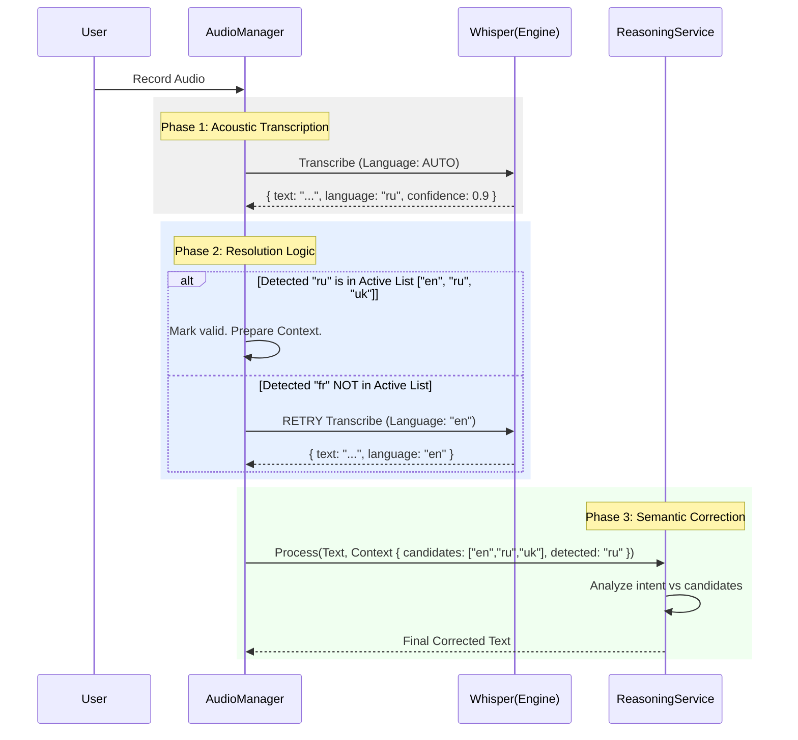

# High-Level Architecture: Multi-Language Support

**Status:** Draft
**Date:** 2025-05-24
**Context:** Moving from single-language selection to a "Candidate List" model with AI-assisted resolution.

## 1. Executive Summary

This architecture enables users to define a set of **Active Languages** (e.g., English, Russian, Ukrainian) rather than a single preferred language. The system dynamically detects which of the active languages is being spoken on a per-utterance basis using a hybrid approach:
1.  **Acoustic Detection:** Whisper engine identifies the probable language from audio features.
2.  **Semantic Resolution:** The Reasoning Service (LLM) uses the user's known language profile to correct acoustic misidentifications (e.g., distinguishing Surzhyk/Ukrainian from Russian).

## 2. Core Concepts

### 2.1 Candidate List Model
Instead of `preferredLanguage: string`, the system maintains:
-   `activeLanguages: string[]`: A subset of languages the user speaks (e.g., `["en", "uk", "ru"]`).
-   `fallbackLanguage: string`: The default language to use if detection fails or produces a language outside the active list (e.g., `en`).

### 2.2 Single-Pass with Intelligent Failover
To minimize latency, we prioritize a "Single Pass" strategy:
1.  **Primary Attempt:** Run Whisper in `auto` detect mode.
2.  **Validation:** Check if the detected language is in the `activeLanguages` list.
3.  **Failover (Conditional):** ONLY re-transcribe (Second Pass) if the detected language is **not** in the active list (e.g., detected "French" when user only speaks "English" and "Spanish").

## 3. Component Architecture

### 3.1 Settings & Storage (`useSettings.ts`)
Responsibility: Persist user language preferences.

```typescript
interface TranscriptionSettings {
  // Primary list of languages for this user
  activeLanguages: string[]; // e.g., ["en", "ru"]
  
  // Safe default if detection goes wrong
  fallbackLanguage: string;  // e.g., "en"
}
```

### 3.2 Acoustic Layer (`whisper.js`, `audioManager.js`)
Responsibility: Convert Audio to Text + Metadata.

*   **Local Whisper:** Executed with `-l auto`. Output parsed to extract `language` and `probability`.
*   **OpenAI API:** Executed with `response_format: "verbose_json"`. This forces the API to return the detected language alongside the text.

### 3.3 Logic Layer: The Resolution Algorithm
Responsibility: Decide if the transcription is valid or needs a retry.

**Algorithm Flow:**
1.  **Input:** Audio, `activeLanguages`, `fallbackLanguage`.
2.  **Action:** Transcribe with `language: "auto"`.
3.  **Check:**
    *   If `detectedLanguage` is in `activeLanguages`: **KEEP**.
        *   *Note:* We keep it even if it might be semantically wrong (e.g., RU vs UA), relying on the Reasoning Service to fix it.
    *   If `detectedLanguage` is **NOT** in `activeLanguages`: **DISCARD & RETRY**.
        *   *Action:* Re-transcribe forcing `language: fallbackLanguage`.
4.  **Output:** Raw Text + `LanguageContext` (detected language, confidence, candidates).

### 3.4 Semantic Layer (`ReasoningService.ts`)
Responsibility: Context-aware correction and dialect cleanup.

The Reasoning Service receives the `LanguageContext`. It constructs a system prompt that informs the LLM of the ambiguity.

**Prompt Strategy:**
> "Whisper detected the language as **Russian** (Confidence: 0.85).
> However, the user also speaks **Ukrainian** and **English**.
> Review the text. If it appears to be **Ukrainian** despite the detection, correct it to **Ukrainian** grammar/spelling.
> Otherwise, clean it up as **Russian**."

This solves the "Acoustic Trap" where phonetically similar languages are misidentified by the acoustic model.

## 4. Data Flow



## 5. API Considerations

### 5.1 OpenAI API / Groq
*   Must use `response_format: "verbose_json"` to get language metadata.
*   Standard `json` format strips this vital info.

### 5.2 Local Whisper (whisper.cpp)
*   Must parse JSON output.
*   Check both top-level `language` field and `segments[0].language` for compatibility across versions.

## 6. Future Extensibility
*   **Manual Override:** The UI could allow forcing a language for a specific session via hotkey combination (e.g., `Cmd+Option+R` for Russian), bypassing the auto-detect logic.
*   **Per-Language Prompts:** Advanced users might want specific system prompts per language (e.g., "For English use UK spelling, for Spanish use Mexican dialect").